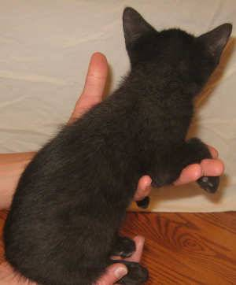
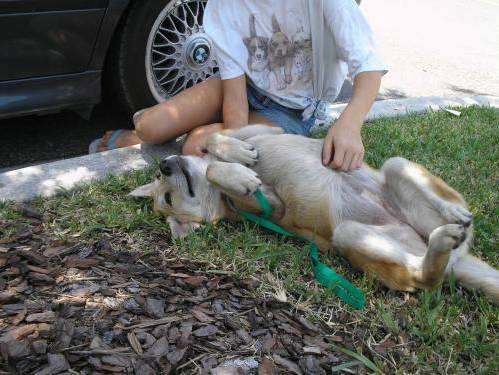
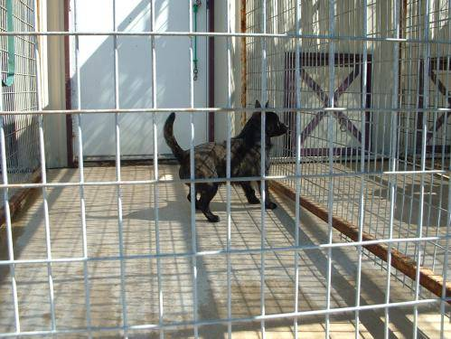
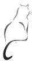
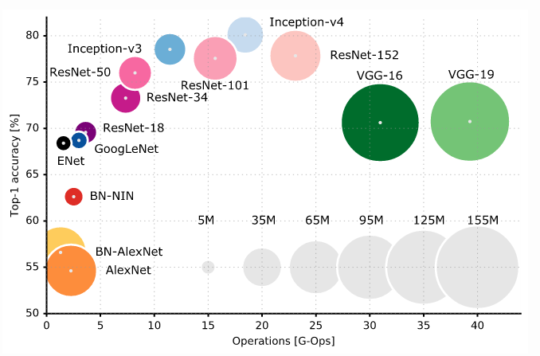

# kaggle_CatvsDog

This has been a Kaggle tradition since 2013 - a classifier that can confidently distinguish between cat and dog! The evaluation metric is the <a href="https://www.kaggle.com/wiki/LogarithmicLoss">log loss function </a> that takes into account how confident the prediction is. In this code, pretrained VGG16 was fine tuned on 12,500 training examples and validated on 3,000 examples in a similar manner as the Keras tutorial (https://blog.keras.io/building-powerful-image-classification-models-using-very-little-data.html). The Convolution Network was ran on Amazon EC2 g2.2xlarge instance, with AMI cs231n_caffe_torch7_keras_lasagne_v2 from Standard's Convolutional Neural Network Course, this AMI comes with Theano, CUDA v7.5, CUDNN v3. This Python algorithm obtained a leaderboard logloss score of 0.29859 for the test data, then the following optimization was carried out:

<ul>
<li>Image data generation: the ImageDataGenerator() function had the biggest impact on model performance. Mean centering and normalization of the training data set resulted in significant improvement, followed by optimizing the values for random rotation, shear and zoom range. </li>
<li>Number of FC dense layers: the number of connections for the add-on dense layer (Dense() before the final layer) should be a relatively small number to avoid overfitting given that it's a binary classification (dog or not dog).
<li>Number of trainable layers: when using pretrained models, it's generally a good idea to freeze most of the bottom layers in the base model to avoid overfitting, especially if you have a small set of training data. Using 12500 training pictures, the weights of the bottom 6 layers were held constant during training. This was found to be optimal. Also, using PReLU activation in the top model led to small improvement in performance (PReLU activation is a more expressive activation function than ReLU).
</ul>

 After optimization, the log loss score obtained was 0.10529 (ranked top 38%), a great improvement from previous models!

Note: other pretrained models (Inception and ResNet50) in Keras Application portals had image size requirement that didn't fit in memory, or it had issues with CuDNN. When configuring the AMI from Standford, it's necessary to upgrade Keras and configure Jupyter Notebook browser access. 

A handy reference chart from the paper <i>An Analysis of Deep Neural Network Models for Practical Applications</i> by Alfredo Canziani, Adam Paszke, Eugenio Culurciello

